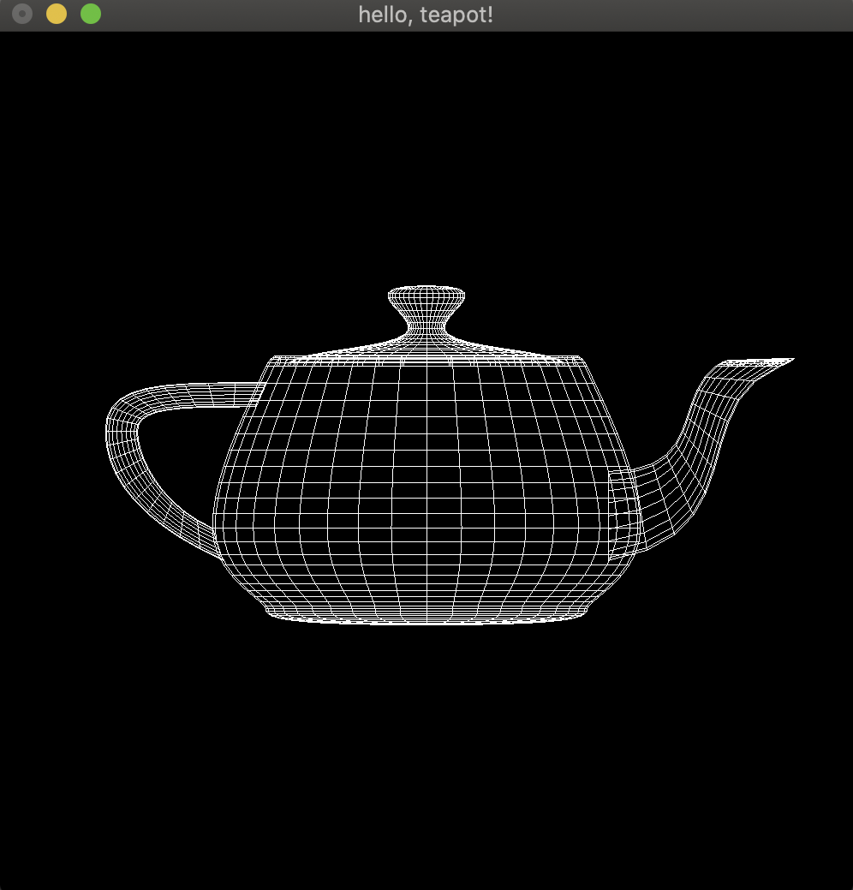

# Lab 8
## OpenGL Installation
### Linux
First, run 
```
sudo apt-get update
```
Then, run the following code and then OpenGL will be installed automatically.
```
sudo apt-get install build-essential
sudo apt-get install libgl1-mesa-dev libglu1-mesa-dev freeglut3-dev -y
```

### macOS
No need to do anything.

### Windows
If you installed MinGW directly, please refer to the `l8.pdf` on Canvas to install OpenGL.

If you use `msys2` to install MinGW, open `msys2.exe` and run the following code.
```
pacman -S mingw-w64-x86_64-freeglut
```

## Test Program
To test whether you have successfully installed OpenGL, you are supposed to compile `main.cpp` in this directory.

### Using command line to compile the program
Open the correct command line, go to the correct folder and then run the correct command according to your operating system.
#### Linux
```
g++ -Wall -Werror -Wpedantic -Wextra -Wconversion -Wvla -std=c++17 -o Glut main.cpp -lglut -lGL -lGLU
```

#### macOS
```
g++ -Wall -Werror -Wpedantic -Wextra -Wconversion -Wvla -Wno-deprecated-declarations -std=c++17 -o Glut main.cpp -framework OpenGL -framework GLUT
```

#### Windows

**IMPORTANT NOTE**: 

If you use `msys2` to install OpenGL, to run the compile command, you should instead open the `mingw64.exe` and run the command in it.
```
g++ -Wall -Werror -Wpedantic -Wextra -Wconversion -Wvla -o Glut -std=c++17 main.cpp -lglu32 -lfreeglut -lopengl32
```

### Using CMakeLists.txt to compile the program

You can use the `CMakeLists.txt` provided in this folder to compile.

### Result
After successfully compile the program, directly run the executable and you can see the following picture.



